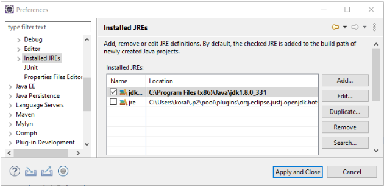
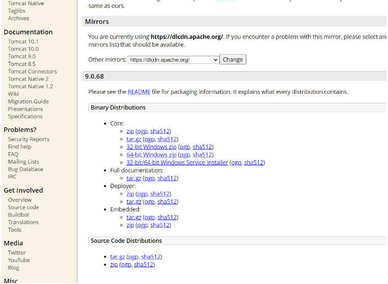
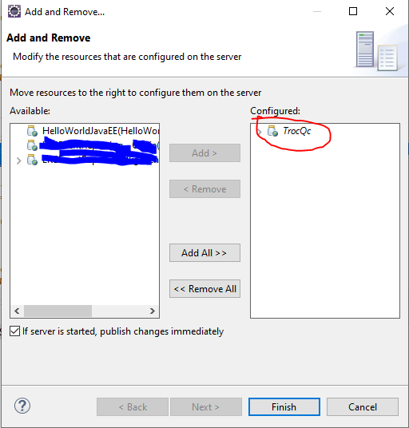

  

  <h3 align="center">TrOqc - Plateforme d'échange entre particuliers</h3>

  
Table of Contents

  <ol>
    <li><a href="#sommaire">Sommaire</a></li>
    <li><a href="#installation">Installation</a></li>
    <li><a href="#utilisation">Utilisation</a></li> 
    <li><a href="#références">Références</a></li>
    <li><a href="#contact">Contact</a></li>
    <li><a href="#remerciements">Remerciements</a></li>
    <li><a href="#licence">Licence</a></li>
  </ol>

# TroQc - Plateforme d'échange entre particuliers

## Sommaire

La vision pour TroQc est de créer une plateforme d'échange entre particuliers afin de participer à la relance économique post-Covid. Étant donnée la courte fenêtre de temps pour développer cette application, nous nous sommes concentrés sur les aspects que nous jugions fondamentaux: le stockage de produits en base de données, la possibilité d'entrer des ventes manuelles, et de calculer le <i> bottom-line </i>. 
    
## Installation

### Installation de Eclipse EE
Le projet utilise l’outil de développement (IDE) Eclipse EE (Eclipse IDE for Enterprise Java and Web Developers). Celui-ci, contrairement à Eclipse de base, offre les fonctionnalités de développement web (Java EE):Eclipse IDE 2022-09 R Packages
### Installation du JDK
Par la suite, il faut installer le JDK de Java approprié. Dans ce cas-ci, le projet utilise la version 8. 

### Lien entre Eclipse EE et le JDK
L’étape suivante implique la modification du lien du JDK dans Eclipse pour pointer vers la version installée à l’étape précédente.
Pour ce faire, dans la barre d’outil cliquez sur “Window”, puis, “Préférence”.

Dans la boîte de préférence, sous la catégorie Java, choisissez “JRE installé”. Si Eclipse ne détecte pas le JDK, ajoutez le, puis sélectionnez le dans la liste. 

  

### Installation de Tomcat
Puis, la  prochaine étape consiste à installer la version 9 de Tomcat. Du même coup, planifiez l’installation de Apache en localhost pour le développement sans serveur.
  

### Connection entre Eclipse et Tomcat
Une fois Tomcat en place, dans Eclipse, cherchez le menu “Windows -> Show View -> Servers” pour afficher l'onglet Servers (seulement si celui-ci fait défaut). Veuillez noter que celui-ci peut manquer dans la liste originale, causant de la confusion. Il faut alors choisir l’option “Other…”, que nous ne trouvons pas évidente:

Pour relier votre serveur Tomcat, cliquez avec le bouton droit de la souris dans l’onglet, et sélectionnez “Nouveau”, puis “Serveur”.

Dans la boîte de dialogue, repérez sous “Apache” l’option Tomcat 9. L’assistant de création comporte plusieurs pages, chacune des valeurs par défaut demeurent adéquates.

### Installation du projet
Il faut d'abord cloner le projet sur le disque. 
Il faut créer une workspace eclipse à la racine du répertoire git et importer le projet.

### Ajout du projet sur le serveur
Dans l'onglet serveur de Eclipse, ajouter le projet à Tomcat
  

### Création de la base de donnée et de l'usager
Il faut installer MySQL sur l'ordinateur local, sur le port 3306, et créer une base de donnée "trocqc" et l'usager "trocqc" y ayant accès, via le mot de passe "BBBbbb222".

### Importation de la base de donnée
Le fichier /c-61/dev/dump-trocqc.sql doit être importé dans la base de donnée trocqc

### Compilation et démarrage
Il faut faire un maven update, un run maven install et démarrer le serveur dans Eclipse

    
## Utilisation

Chaque section est un module
Chaque module a:
- son servlet, qui gères les requêtes http.
- son DAO pour l'accès avec la base de donnée
- ses entités, qui sont souvent partagée entre les modules
- sa page JSP, et parfois, son code JavaScript

Par contre, il n'y a qu'un controlleur central, le frontcontrolleur, vu que la gestion des entrées sont faites dans les servlets.

Par example, la page inventaire a:
- le fichier inventaire.jsp
- le fichier inventaire.js
- Les entités principales:
  - Product
  - Pawmaterial
  - Lot
- les entites secondaires:
  - RawmaterialsPerProduct
  - ProductCustomFields
  - RawMaterialsCustomFields
  - UnitOfMeasure
- la classe inventaireDao, qui récupère, ajoute et sauvegarde les entités ci-haut

    
## Références
- <a href="https://www.baeldung.com/spring-jdbc-jdbctemplate">The JDBC Template</a>
- <a href="https://www.baeldung.com/jpa-entities">How to use jpa entities</a>
  - deux resources sur comment Accéder à MySQl depuis Spring.
- <a href="https://www.geeksforgeeks.org/servlet-display-image/">Servlet Display Image</a>
	- inspiration pour l'affichage d'une image dans le servlet getUserAvatar
- <a href="https://www.digitalocean.com/community/tutorials/java-session-management-servlet-httpsession-url-rewriting">Session Management in Java</a>
  - explique comment gérer une session en Java
- <a href="https://www.tutorialspoint.com/java/java_sending_email.htm">JAVA -sendin emails</a>
	- Fourni un example de code pour envoyer un courriel, qui a été refactoré en une seule fonction
- <a href="https://docs.oracle.com/javase/tutorial/java/generics/types.html">Java Generics</a>
	- Cette page officielle de Oracle explique les classes génériques (qui prennent un type)
-	<a href="https://www.w3schools.com/java/java_iterator.asp">Java Iterator</a>
	- Cette page explique comment implémenter un itérateur
- <a href="https://en.wikipedia.org/wiki/Pearson_correlation_coefficient">Pearson Colleration Coefficient</a>
	- Ce lien explique comment calculer un coefficient de correlation, mathématiquement
- <a href="http://faculty.cas.usf.edu/mbrannick/regression/Part3/RegBasics.html">Regression Basics</a>
	- Ce lien donne plusieurs versions du calcul de A et B pour la regression. 
- <a href="https://www.mathsisfun.com/data/standard-deviation-formulas.html">Formule d'écart type</a>
	- Ce site liste comment faire un calcul d'écart type
- <a href="https://www.javatpoint.com/java-create-excel-file">Create excel file in Java</a>
	- Excellente source pour comment créer un fichier excel depuis Java

    
## Contact
    Korallia Frenette <a href="mailto:koralliafrenette@gmail.com">koralliafrenette@gmail.com</a>
    William Lemire <a href="mailto:wlemire.wl@gmail.com">wlemire.wl@gmail.com</a>

    
## Remerciements
     - Jean-Christophe Demers pour l'encadrement et la supervision du projet, et d'avoir aidé à bien définir le projet
     - Paul Sherman de Micro Focus pour avoir enseigné Spring lors d'un stage avant le début du projet.
