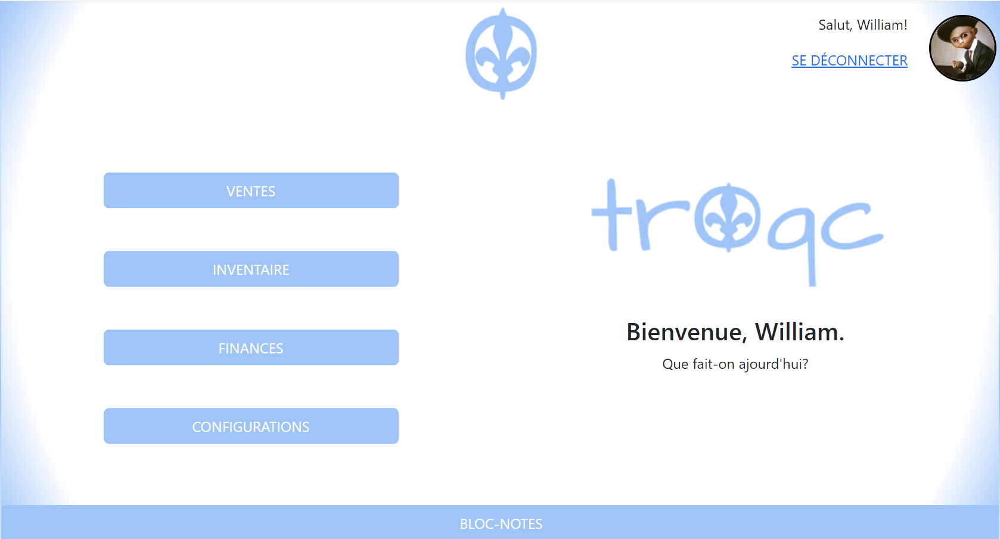

  

  <h3 align="center">TrOqc - Plateforme d'échange entre particuliers</h3>

  
Table of Contents

  <ol>
    <li><a href="#sommaire">Sommaire</a></li>
    <li><a href="#installation">Installation</a></li>
    <li><a href="#utilisation">Utilisation</a></li>
    <li><a href="#références">Références</a></li>
    <li><a href="#contact">Contact</a></li>
    <li><a href="#remerciements">Remerciements</a></li>
    <li><a href="#licence">Licence</a></li>
  </ol>

# TroQc - Plateforme d'échange entre particuliers

## Sommaire

La vision pour TroQc est de créer une plateforme d'échange entre particuliers afin de participer à la relance économique post-Covid. Étant donnée la courte fenêtre de temps pour développer cette application, nous nous sommes concentrés sur les aspects que nous jugions fondamentaux: le stockage de produits en base de données, la possibilité d'entrer des ventes manuelles, et de calculer le <i> bottom-line </i>. 
    
## Installation
    Instructions nécessaires à la mise en place de l’infrastructure de développement (langage, librairie, IDE …).
    Ces informations sont destinées à un programmeur qui désire utiliser votre projet dans un contexte de
    développement.
    
## Utilisation
### Authentification

Afin d'utiliser la plateforme, l'utilisateur doit s'authentifier. Suite à une authentificaition réussie, il pourra accéder aux modules.

### Création de compte

Afin d'utiliser la plateforme, l'utilisateur doit se créer un compte avec lequel il pourra s'authentifier. 

### Module de Lobby

Après une authentification réussie, l'utilisateur est redirigé vers le module de lobby. De là, il pourra accéder aux autres modules (Ventes, Inventaire, Finances, et Configurations). De plus, il peut se laisser des notes avec le Bloc-Notes au bas de la page. Elles sont modifiables et peuvent être détruites en cliquant dessus.

### Module d'inventaire
Dans ce module, l'utilisateur peut gérer son inventaire. L'idée est d'insérer dans les matériels tous les items utilisés dans la création d'un produit. Par exemple, quelqu'un qui vend des magrets de canards, ajouterait du magret en dans les matériaux, ainsi que chaque ingrédient requis. 

Ensuite, l'utilisateur crée un Gabarit, soit un produit finit qui comprend les ingrédients nécessaires à sa création, ainsi que les informations de ce produit, comme son nom, SKU, description, prix, etc. Par exemple, l'utilisateur pourra créer un gabarit de son magret de canard au syrop d'érable. Il entrera ce nom et remplira les autres champs, et choisira les matériaux pour le créer et la quantité de chaque.

Finalement, l'utilisateur peut se créer des lots avec ces gabarits, et les produits de ces lots sont ceux qui sont destinés à la vente. Chaque insertion de produit crée un nouveau lot, qui représente la création d'un produit.
Par exemple, quand l'utilisateur produit des magrets au syrop d'érable, il en crée 5 de 200g à chaque fois, nécessitant 1kg de magret ainsi qu'une quantité X des autres ingrédients. En ajoutant ces 5 items dans la section produit, il y a une vérification qu'il y a assez de matériaux dans l'inventaire pour créer le lot. Si oui, la quantité des matériaux est mise à jour en base de donnée, et les 5 magrets au syrop d'érable peuvent être vendus dans le module de ventes.  

### Module de finances
Ce module sert à comptabiliser les coûts (insertions de matériaux en base de donnée, coûts mensuels, ou autres coûts) et les ventes (que ventes manuelles pour l'instant), afin d'afficher à l'écran le <i> bottom-line </i> pour la période de temps spécifiée par l'utilisateur. L'utilisateur peut aussi faire une projection des ventes pour une période de temps spécifiée.

### Module de ventes
Dans cette version de la plateforme, les ventes doivent être entrées manuellement, en entrant le nom de la personne qui achète, le produit désiré, et la quantité. Si la quantité spécifiée est en inventaire, une vente est créée. 

### Module de configurations
L'utilisateur peut configurer la génération du code SKU de ses produits. En créant un gabarit, si le champs SKU est laissé vide, le SKU par défaut spécifié dans les configurations est appliqué. L'utilisateur aura le choix de toutes les colonnes par défaut dans la table produits, ainsi que celles crées par lui dans la table de CustomUserProperties. Il pourra choisir combien de lettres de chaque colonne est à utiliser (si applicable) dans le SKU, ainsi que le caractère pour séparer ces groupes de lettres. 
    
## Références
    La liste des références utilisées pour la réalisation de votre projet (avec liens hypertextes lorsqu’ils
    s’appliquent).
    
    
## Contact
    (section optionnelle)
    
## Remerciements
    (section optionnelle – par exemple, un enseignant autre que celui du cours qui vous a aidé)
